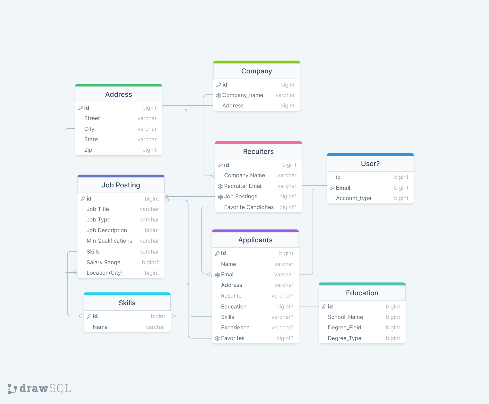
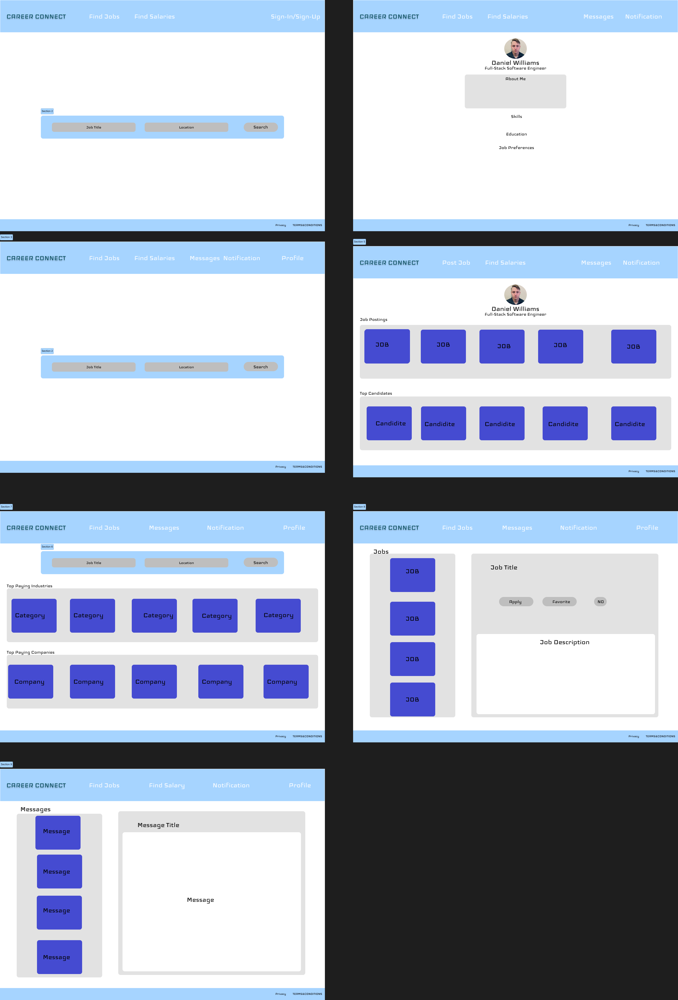

# CareerConnect - Your Ultimate Job Search Solution

CareerConnect is a comprehensive job search and posting platform that aims to simplify the job search process for both job seekers and employers. With CareerConnect, you can easily create, edit, and delete job postings, upload and manage resumes, and connect with potential employers or candidates. 

## Features

### User Authentication
- **Sign-up:** Register for a CareerConnect account to access all features.
- **Log-in:** Log in securely to your account.
- **Log-Out:** Safely log out when you're done.
- **Profile Creation:** Create a detailed profile to showcase your skills and experience.

### Employer Features
- **Job Posting:** Employers can easily create, edit, and delete job postings.
- **Search for Candidates:** Find candidates with matching skills and qualifications.

### Candidate Features
- **Job Search:** Search for jobs by category, company, or matching skills.
- **Integration with AZUNDA Job API:** Explore additional job opportunities through AZUNDA job API integration.

CareerConnect leverages Django with Python for its backend infrastructure, providing a robust and secure foundation for web application and RESTful API development. On the frontend, React.js is employed to create dynamic and responsive user interfaces, enhancing the user experience with its component-based architecture and efficient state management. This combination of Django on the backend and React.js on the frontend ensures a modern, scalable, and user-friendly platform, facilitating seamless data communication and real-time updates for job seekers and employers alike.

## Pitch

Are you tired of scrolling through endless job listings, struggling to find the perfect job opportunity? Look no further! CareerConnect is here to revolutionize your job search experience. Whether you're an employer looking for top talent or a candidate seeking your dream job, CareerConnect has you covered.

Our platform is designed to bring job seekers and employers together seamlessly. Employers can effortlessly manage job postings and discover candidates with the right skills. Candidates can showcase their qualifications, manage resumes, and explore job opportunities tailored to their expertise.

Join CareerConnect today and simplify your job search journey!

CareerConnect - Bringing Job Seekers and Employers Together!

Schema Design
 

Initial Webpage Design 
 
